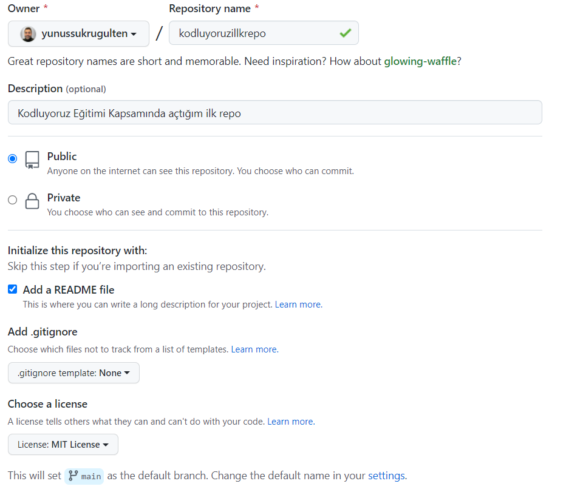

# kodluyoruzilkrepo

Bu repo [Patika.dev](https://www.patika.dev) *Github'ta Repo İşlemleri Ödevi* için oluşturduğum ilk repo. İçerisinde bir adet README dosyası ve bir adet de index.html barındırıyor.

## Patika.dev hesabım
[Yunus Şükrü Gülten](https://app.patika.dev/yunussukrugulten)

## Proje Resmi


## Installation

Öncelikle projeyi clonelayın. (Buraya sizin reponuzdan aldığınız link gelecek)

```bash
git clone https://github.com/yunussukrugulten/kodluyoruzilkrepo.git
```

## Usage

Projeyi cloneladıktan sonra Visual Studio Code programında açınız.

Linux için:
```linux
cd kodluyoruzilkrepo
code .
```

## License
[MIT](https://choosealicense.com/licenses/mit/)