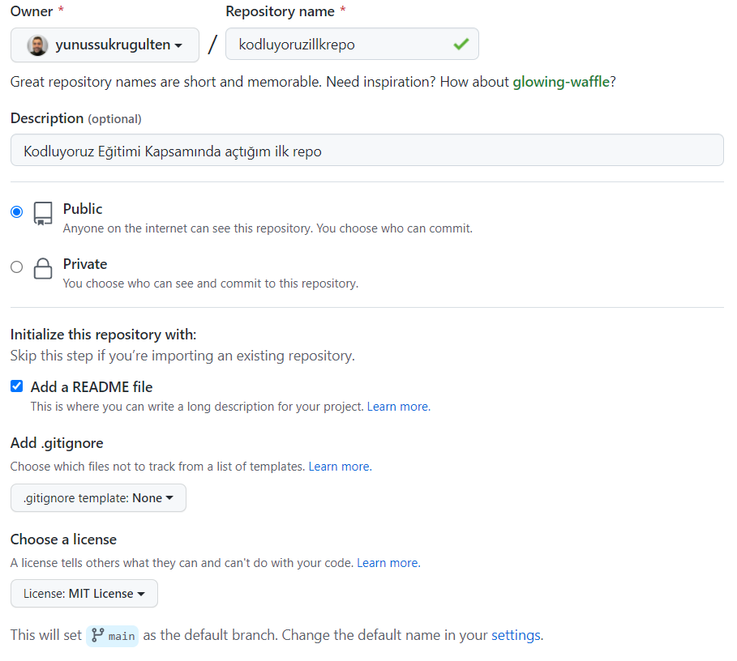

## kodluyoruzilkrepo
The first repo I opened within the scope of We Code Training.

## Patika.dev Account
[Yunus Şükrü Gülten](https://app.patika.dev/yunussukrugulten)

## Project Picture


## Installation
```bash
git clone https://github.com/yunussukrugulten/kodluyoruzilkrepo.git
```

## Usage
```linux
cd kodluyoruzilkrepo
code .
```

## License
[MIT](https://choosealicense.com/licenses/mit/)
